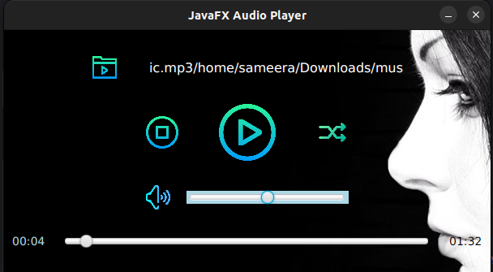
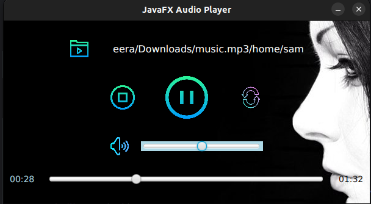

<!-- ABOUT THE PROJECT -->
# <b>JavaFX Audio Player</b>

### Version 1.0.0

JavaFX Audio Player was created using Java and JavaFX with a view of
learning how the event handlers work and how the MediaPlayer object works in JavaFX. 
This audio player has ability to Open, Play, Pause, Mute, Unmute, Adjust Volume, Loop an audio file in your computer.

## Built with using

* Java 
* JavaFX

### License
Copyright 2023 SAMEERA. All Rights Reserved.